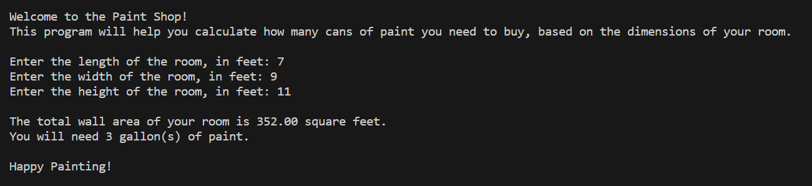

# The Paint Shop Exercise

This is an in-class exercise to practice the concepts worked until this point in our Python Programming classes. E.g., input/processing/output, variables, operators, data types, casting, and formatting.

## Scenario

Code a Python program that calculates the amount of paint you need to cover the walls in your family room. The salesperson at the home improvement store told you to buy 1 gallon of paint for every 150 square feet of wall you need to paint.

Assuming that the room is rectangular in shape, the program should take in as input the width of your two sets of walls and the height of the room.

The program should output the number of gallons required to paint the room. Paint is sold only by the gallon.

## Sample output

